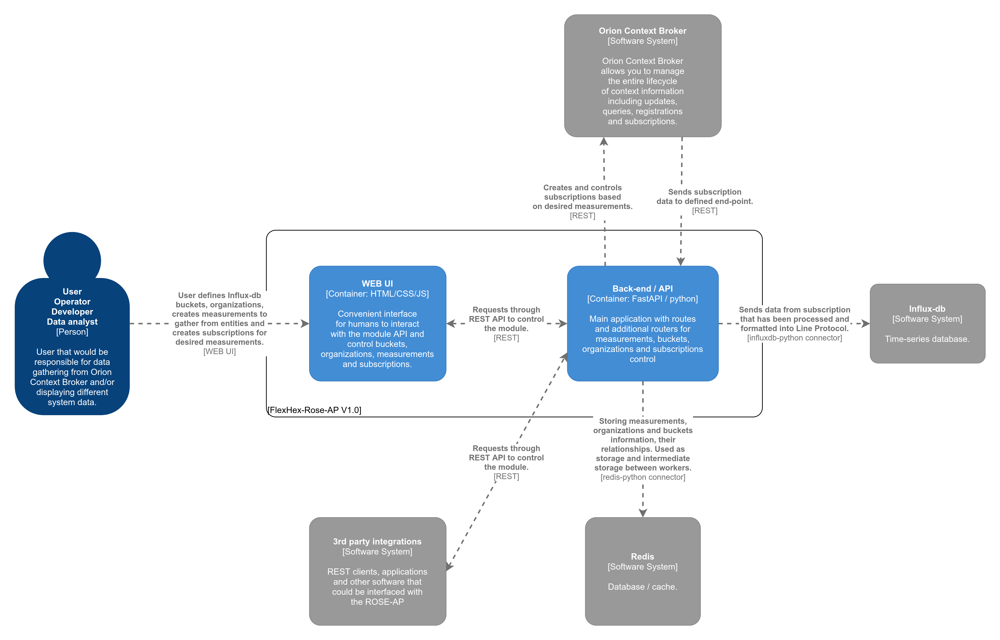

# Architecture

## Architecture blocks

### Main piece of the ROSE-AP is the **Back-end / API**.

It handles requests for measurements, buckets, organizations, subscriptions management ([CRUD](https://en.wikipedia.org/wiki/Create,_read,_update_and_delete)) and fetching of WEB pages.

It processes and uploads incoming data from Orion Context Broker subscriptions into Influx-db. 

### WEB UI

Interface for users consisting of WEB pages to control Measurements, Buckets, Organizations and Subscriptions.

### Influx-db

Time-series database used as storage end-point by the ROSE-AP for desired historical data that is defined with measurements.

### Redis

Database to store and persist between workers measurement, bucket and organization data and their relationships.

### Orion Context Broker

Data source of the desired information from entities. Subscriptions and entities management. 

Sends measurement subscription data into ROSE-AP end-point.

### 3rd party integrations (as API use-case example)

Using the exposed API, 3rd party software can interface with the ROSE-AP to control and automate measurement, bucket and organizations creation. It also can create, delete and manipulate subscriptions, providing a flexible way to gather desired data.

## Software used
- FastAPI (Python).
- Redis.
- Influx-db.
- Orion Context Broker.
- Bootstrap studio (UI builder).
